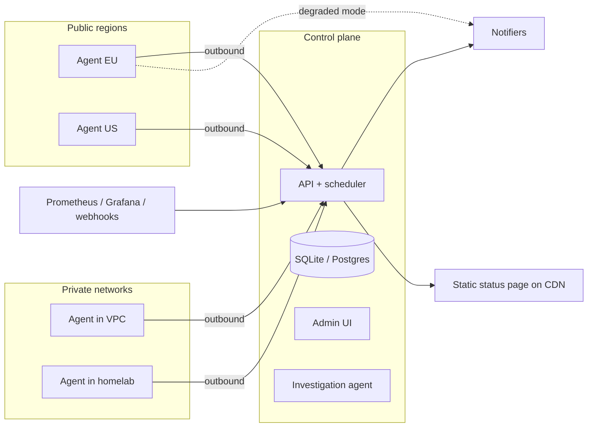

# Architecture

Draft. Stack: .NET.

## Components



- **Control plane:** API, scheduler, alert engine, on-call, UI, AI agent. Single process by default; the agent role can also run in-process for single-node installs.
- **Agents:** stateless-ish binaries that run check plugins. Always connect outbound to the control plane, so they work behind NAT.
- **Status page:** rendered to static files and pushed to a bucket or CDN, so it survives a control plane outage.

## Deployment guidance

The control plane should live outside the blast radius of what it monitors: a different cloud account, provider, or a cheap VPS. Agents go wherever there is something to observe.

## Agent autonomous degraded mode

Agents must keep monitoring and alerting when the control plane is unreachable.

1. **Cached assignments.** Each agent persists its assigned checks and a minimal notification config locally.
2. **Keep probing.** Checks continue on schedule without the control plane.
3. **Buffer results.** Results are stored locally and uploaded when the connection returns, so incident history has no gaps.
4. **Control plane loss is an alert.** After losing the control plane for N minutes, each agent notifies once through its fallback channel (ntfy, Telegram, external SMTP), including its name and labels. Several agents reporting it at once tells you the monitor is down and from where it is visible. One more notice when the connection returns.
5. **Checks alert directly.** While disconnected, each agent evaluates its own checks with the cached rules and notifies directly on failure. There is no coordination between agents: if 6 of 6 agents see a check fail, 6 notifications go out. Each one names the agent, which is itself useful information (global vs regional failure).
6. **Bounded per agent.** An agent notifies on state transitions only (down once, recovered once) per check, never on every failed probe, and respects the rule's failure / success thresholds.
7. **Reconciliation.** On reconnect, the agent uploads buffered results and the list of fallback notifications it sent. The control plane evaluates quorum over the buffered data, creates or updates the alerts, and links the fallback notifications to them, so nobody is paged a second time for the same failure.

Inverse case: the control plane treats a silent agent as lost visibility for that region or network, not as a service outage.

### Fallback config cached on the agent

- Rules for each assigned check (dimension, threshold, failure / success counts).
- Fallback channels: one or more notifier plugin instances with credentials, encrypted at rest with a key bound to the agent.
- Agent-level settings: disconnect timeout before notifying, local result retention.

Fallback channels are configured per agent label group (for example all agents with `env=prod` notify the `ops-fallback` ntfy topic), not per check.

## Agent protocol

Two channels, both initiated by the agent (works behind NAT):

| Channel | Transport | Used for |
|---|---|---|
| Control | SignalR over WebSocket | Registration, assignments, config change nudges, heartbeats |
| Data | HTTPS | Result batches, buffered upload after reconnect, plugin downloads |

The control channel only carries small messages. Anything bulky or that must be retried goes over HTTPS, so results are never lost because a socket dropped.

### Authentication

- Agent enrolls with a one-time enrollment token created in the UI or CLI.
- Enrollment returns an agent id and a long-lived agent credential (stored hashed on the control plane, rotatable, revocable).
- Every request and the SignalR connection authenticate with that credential.

### Messages

Control, agent -> control plane:

| Message | Payload |
|---|---|
| `Hello` | agent id, version, SDK version, labels, installed plugins, last assignment revision |
| `Heartbeat` | timestamp, running checks count, buffer size |

Control, control plane -> agent:

| Message | Payload |
|---|---|
| `Assignments` | revision, full list of checks (id, plugin@version + sha256, config, interval, rules) and fallback config |
| `AssignmentsChanged` | new revision; agent fetches the full set over HTTPS |
| `RunNow` | check id (manual trigger from UI) |

Data, agent -> control plane (HTTPS):

| Endpoint | Purpose |
|---|---|
| `POST /agent/v1/results` | Batch of results. Idempotent by result id (UUIDv7 generated on the agent) |
| `POST /agent/v1/fallback-notifications` | Notifications sent while disconnected, for reconciliation |
| `GET /agent/v1/assignments?rev=` | Full assignment set |
| `GET /agent/v1/plugins/{id}/{version}` | Plugin package download |

Assignments are always sent as a full snapshot with a revision, never as deltas, so an agent that missed messages converges on the next fetch.

## Check evaluation

- Each probe returns an outcome (up, down, error) plus dimensions (latency, status code, days to expiry).
- Alert rules evaluate dimensions with thresholds and consecutive-failure counts.
- Quorum across agents decides the check state.
- Error (the probe could not run) is different from down (the target failed).

## Alert flow

```
check state change / inbound webhook
  -> normalize to alert
  -> dedup + group by fingerprint
  -> match service + escalation policy (by labels)
  -> notify on-call (outbox, retries, fallback channel)
  -> [v1] trigger investigation, attach summary to alert
```

Delivery uses an outbox table so a crash never loses a notification.

## AI investigation (v1)

- Triggered asynchronously; never on the notification critical path.
- Tool-calling loop over context provider plugins, exposed as MCP tools.
- Output: summary, hypotheses ranked, evidence links. Stored on the alert / incident.
- Budget per investigation (steps, tokens, time).
