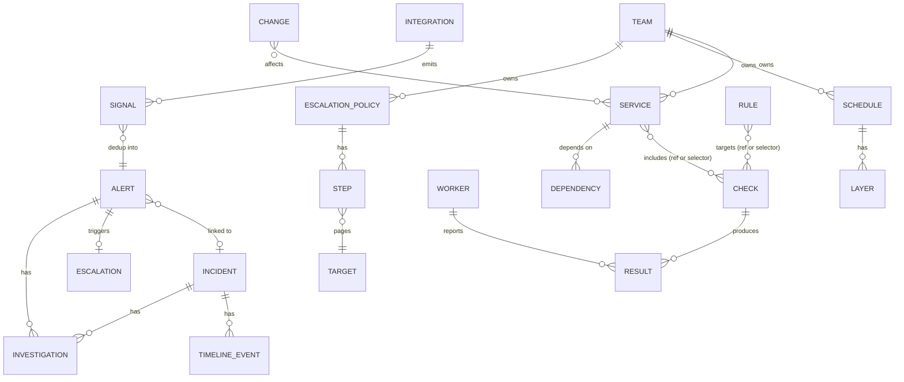

# Domain model

Status: rows 1-13 of the table below accepted on 2026-09-26.

Based on Piro's domain (`src/Piro.Domain`, commit `7761090`), keeping what works and fixing what limits it.

## What Piro gets right (keep)

- Service dependencies with propagation modes (blocking, soft, advisory) and cycle rejection.
- Dimensions on data points and generic alert rules over them.
- Escalation policy -> ordered steps -> on-call schedule with RRULE layers and overrides.
- Incident timeline, impact changes, public vs private visibility.
- Notification outbox and delivery logs.
- Tag selectors (`allOf`, `anyOf`, `in`, `notIn`, `exists`) to pin checks to workers.
- Integration as a configured instance of a plugin.

## What to do differently

| # | Piro | Problem | Vigia |
|---|---|---|---|
| 1 | `CheckType` and `AlertSource` are enums | Contradicts the plugin model; adding a plugin touches core | Plugin ids are strings (`http`, `alertmanager`) |
| 2 | A check belongs to exactly one service | A DNS or TLS check often affects several services | Checks are standalone; services include checks by reference or label selector |
| 3 | `Alert` holds escalation state (current step, attempts, exhausted) | Mixes "what happened" with "who are we paging" | Split into `Alert` and `Escalation` |
| 4 | No teams | No ownership; routing is service -> policy only | `Team` owns services, schedules, policies |
| 5 | Escalation steps only target schedules | Cannot page a specific user or a channel | Step targets: schedule, user, team, channel |
| 6 | Alert rules live on one check | Same rule repeated for every TLS check | Rules can target a check or a selector (`plugin=tls`) |
| 7 | Tags need a join table per entity (`ServiceTag`, `CheckTag`, `WorkerTag`) | Every new entity needs new tables | `labels` column (`jsonb` / JSON) on every entity, one selector engine |
| 8 | `CurrentStatus`, `PublicStatus`, `DefaultStatus` stored on service | Derived state stored as truth, easy to drift | Store inputs (health, maintenance, manual override); derive status |
| 9 | Timestamps mix `long`, `DateTime`, `DateTimeOffset` | Bugs at every boundary | `DateTimeOffset` UTC everywhere |
| 10 | `int` ids | Not stable across instances for config as code | UUIDv7 ids + human `slug` as config-as-code identity |
| 11 | No record of changes (deploys, config) | The first question in any incident is "what changed?" | First-class `Change` entity |
| 12 | Nothing for external providers | Third-party failures look like our failures | `Service.kind = external` (Sabre, Stripe, DNS provider) |
| 13 | No ownership flag for config as code | UI edits and YAML apply can fight | `managedBy: ui | yaml | terraform` per entity |

## Entities



### Common fields

Every configurable entity has:

```
id          uuid v7
slug        unique, stable, used by YAML
name
labels      map<string,string>
managedBy   ui | yaml | terraform
createdAt, updatedAt   DateTimeOffset UTC
```

### Catalog

- **Team**: owns things. Members with a role inside the team.
- **Service**: what users care about. `kind: internal | external`. Includes checks by reference or selector. Has dependencies. Health is derived.
- **Dependency**: service -> service, with propagation mode.
- **Change**: something that changed at a point in time (deploy, config change, feature flag, provider notice). Comes from source plugins or the API. Linked to services by labels.

### Monitoring

- **Check**: instance of a check plugin. `plugin`, `config` (validated by the plugin schema), `interval`, `agentSelector`, `quorum`.
- **Worker**: registered worker. Labels (`region`, `network`), last seen, version, mode (`connected | degraded`).
- **Result**: one probe from one worker. Outcome (`up | down | error`), dimensions, message, timestamp. Time-series storage, retention policy.
- **Rule**: condition over a dimension (`latency > 800ms for 3`), severity, targets a check or a selector.

### Alerting and response

- **Signal**: raw event from a rule evaluation or an inbound source. Immutable. Stored briefly for debugging (replaces Piro's webhook request log).
- **Alert**: deduplicated signals sharing a fingerprint. State: `firing | acknowledged | resolved | silenced`. Occurrence count.
- **Escalation**: one paging process for one alert. Current step, attempts, delivery log. Ends on ack, resolve, or exhaustion.
- **EscalationPolicy** -> **Step**: delay, repeat, targets.
- **Target**: `schedule | user | team | channel`.
- **Schedule** -> **Layer** (RRULE, users in rotation) + **Override**.
- **ContactMethod**: per user, ordered, verified (email, Telegram, ntfy...). Each points to a notifier plugin.
- **Silence**: selector + time window. Suppresses notification, not recording.
- **Maintenance**: selector + time window + public message. Silences and shows on status page.

### Incidents

- **Incident**: human-declared, links alerts and services. Status, impact, visibility.
- **TimelineEvent**: status updates, notes, linked alerts, investigation findings.
- **Postmortem**: later phase.

### AI

- **Investigation**: run of the investigation agent for an alert or incident. Status, budget used, summary, ranked hypotheses.
- **Evidence**: item cited by an investigation (log query, metric window, change, result diff between workers). Links back to its source.

### Status page

- **StatusPage**: groups services for public display. Rendered to static files.

### Platform

- **Integration**: configured instance of a plugin (credentials, settings). Secrets encrypted.
- **User**, **ApiKey**, **Session**, **AuditLog**.

## Status derivation

```
check health   = quorum over latest results per worker
service health = worst of included checks, then dependency propagation
public status  = maintenance ? maintenance
               : manual override ? override
               : service health
```

Nothing derived is written as source of truth; it is recomputed or cached with its inputs.

## Signal -> alert -> escalation

```
Result ──rule──┐
               ├─> Signal ──fingerprint──> Alert ──policy──> Escalation ──> Notifications
Source plugin ─┘                              │
                                              └──> Investigation (async, v1)
```

- Fingerprint default: `source + rule/check + labels subset`. Source plugins can override.
- Alert resolves when the underlying rule recovers (with success threshold) or the source sends resolve.
- Alerts never create incidents automatically (same as Piro); an incident is a human decision. Open: allow an opt-in rule for critical services.
